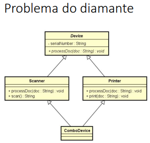
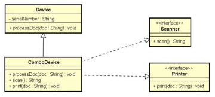

# 🧩 Diamond Problem com Interfaces em Java

Este projeto faz parte dos meus estudos sobre **interfaces e herança múltipla em Java**. O objetivo principal foi entender como o uso de **interfaces simples** permite simular herança múltipla **sem ambiguidade**, resolvendo o clássico **Problema do Diamante (Diamond Problem)**.

---

## 📌 Objetivo

Demonstrar, de forma prática, como o Java permite que uma classe implemente múltiplas interfaces e **evite conflitos de herança** que ocorreriam se fossem usadas classes abstratas.

---

## 📚 O que eu aprendi

✅ Como simular herança múltipla usando interfaces  
✅ Como uma classe pode implementar múltiplas interfaces sem ambiguidade  
✅ Estruturação de código orientado a objetos com responsabilidade clara  
✅ Criação de métodos concretos em uma classe que implementa comportamentos múltiplos  
✅ Importância da **designação explícita de responsabilidade**

---

## 💡 Diagramas comparativos

### ❌ Modelo com herança de classes (problema):



### ✅ Solução com interfaces:



---

## 🧠 Estrutura do projeto

```
comboDeviceDiamondProblem/
├── entities/
│   ├── Device.java         // Interface base
│   ├── Scanner.java        // Interface com método scan()
│   ├── Printer.java        // Interface com método print()
│   └── ComboDevice.java    // Classe concreta que implementa Scanner e Printer
├── application/
│   └── Program.java        // Classe principal com execução do exemplo
├── diagrama_heranca_multipla.png
├── diagrama_interfaces.png
└── README.md
```

---

## 🚀 Como executar

Compile os arquivos:
```bash
javac application/Program.java
```

Execute o programa:
```bash
java application.Program
```

---

## 🛠️ Tecnologias usadas

- Java 17+  
- Programação orientada a objetos (POO)  
- Interfaces simples (sem métodos default)  
- Diagramas UML para visualização de herança

---

## 👨‍💻 Autor

Desenvolvido por **Guilherme Guerra**